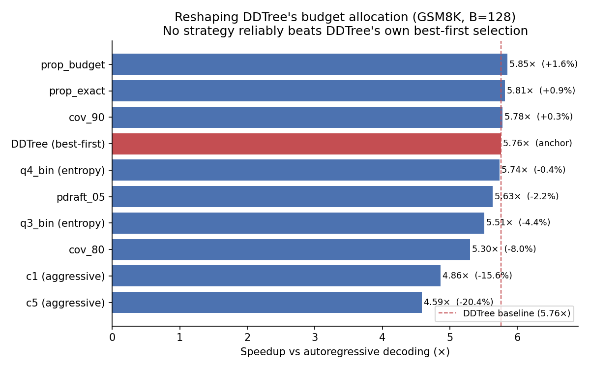

# Can we reshape DDTree's draft tree to go faster? (Not really)

*Setup: Qwen3-4B target + Qwen3-4B-DFlash-b16 drafter, GSM8K, single RTX 6000 pro GPU.*

## What DDTree actually does

DDTree (*Diffusion Draft Tree*, from "Accelerating Speculative Decoding with Block
Diffusion Draft Trees", arXiv:2604.12989) is **not** a static, pre-baked tree. Each
decoding round it builds a fresh draft tree from the block-diffusion drafter's
per-position distributions, using a **best-first heap** that pulls in the
highest-probability prefixes until a **node budget B** is reached. In the paper's
words, it *"selects a compact set of promising continuations under a specified
tree-node budget"* via a *"simple best-first heap algorithm."* The branching width at
each depth is **not** prescribed. It emerges from pure probability ranking under the
budget B (tested at B ∈ {16…1024}; our runs use B = 128).

So DDTree's tree is already *dynamic in shape*. What's fixed is (a) the total node
budget B and (b) the selection rule: uniform top-k per depth, ranked purely by draft
probability. In this repo that configuration is the `fixed` / `ddtree_tb128` mode
(`ddtree.py`: uniform top-k per depth → best-first heap up to budget B). **It is the
faithful DDTree paper method, and it is our baseline/anchor.**

## TL;DR

We asked whether we could beat DDTree's best-first-under-budget selection by
allocating the budget *non-uniformly*: spending more width where the model is
uncertain (entropy), targeting a coverage fraction, scaling width by draft mass, or
*learning* a per-round shape with RL.

We implemented seven alternative budget-allocation strategies and benchmarked them
against DDTree's own best-first method. **None reliably beats it.** The best variant
edged it by ~1.5%; the more aggressively reshaped trees
lost 16–20% of the speedup; the learned RL policy underperformed DDTree outright.

Negative, but worth writing down: DDTree's probability-ranked best-first selection is
a stubborn baseline, and "allocate the budget more cleverly" is not the free lunch it
looks like.

## Background

Speculative decoding with a tree-structured draft proposes many candidate
continuations per step and verifies them in one target-model pass. Given a fixed node
budget B, DDTree spends it by best-first probability ranking. The open question we
poked at: *given the same budget B, is uniform-top-k/best-first the right way to
spend it, or can a smarter per-depth allocation accept more tokens per round?*

We tested that directly. Every strategy below uses the **same** drafter, target,
verification, and node budget; they differ only in how the per-depth branch widths
are chosen before the tree is built.

## Strategies compared

All strategies share the same drafter, target, verification, and node budget B; they
differ only in how the budget is allocated into per-depth branch widths before the
best-first tree is built.

| ID | Strategy | Idea |
|----|----------|------|
| `baseline` | **DDTree paper (best-first under budget B)** | Anchor: uniform top-k per depth, probability-ranked best-first heap |
| `prop_budget` | Budget-proportional (α=1.0) | Allocate width proportional to draft mass |
| `prop_exact` | Budget-proportional, exact budget | Same, with exact per-round budget |
| `cov_90` | Coverage-based (0.90) | Branch until 90% probability covered |
| `pdraft_05` | Draft prob-threshold (0.05) | Keep branches above a draft-prob floor |
| `q3_bin` / `q4_bin` | Entropy-bin adaptive | Wider widths in high-entropy bins (quantile thresholds from real draft-logit profiling) |
| `rl` | Learned RL scheduler | Policy trained on GSM8K to pick a per-depth width profile per round |

Every alternative is a different answer to "given budget B, how should the per-depth
widths differ from DDTree's uniform top-k?" The entropy thresholds (`q3_bin`,
`q4_bin`) come from profiling ~4,200 real draft-logit samples, so they're calibrated
to this model, not guessed. The RL policy chooses among a discrete menu of width
profiles (`flat`, `front_heavy`, `entropy_sharp`, `entropy_proportional`,
`front_aggressive`) from features including entropy, draft confidence, and round
depth.

## Results

Speedup is relative to vanilla autoregressive decoding; "acceptance" is mean accepted
draft length per round. DDTree's best-first method is the anchor at **5.76× / 9.08**.

| Strategy | Speedup | Mean acceptance | Δ vs DDTree |
|----------|--------:|----------------:|------------:|
| `prop_budget` | 5.85× | 8.86 | **+1.6%** |
| `prop_exact` | 5.81× | 8.95 | +0.9% |
| `cov_90` | 5.78× | 8.82 | +0.3% |
| **`baseline` (DDTree paper, best-first)** | **5.76×** | **9.08** | **0.0%** |
| `q4_bin` (entropy) | 5.74× | 8.90 | −0.4% |
| `q3_bin` (entropy) | 5.51× | 8.65 | −4.4% |
| `pdraft_05` | 5.63× | 8.68 | −2.2% |
| `cov_80` | 5.30× | 8.39 | −8.0% |
| aggressive entropy (c1/c2/c5) | 4.59–4.86× | 7.01–7.47 | −16% to −20% |

The RL policy, evaluated over 4,392 rounds, reached **8.68 mean accepted length,
below DDTree's 9.08**, at ~17.3 ms/round, and in practice collapsed onto one or two
of its actions (`entropy_sharp` ~47% of rounds). Learning didn't help.

### How to read this

- **DDTree's best-first selection is hard to beat.** The three strategies that "beat"
  it (`prop_budget`, `prop_exact`, `cov_90`) do so by 0.3–1.6%, which is inside the
  noise of our setup (see caveats). We do not claim these as real wins.
- **Reshaping the budget has a cost.** Every method that moved the per-depth widths
  meaningfully away from DDTree's uniform-top-k (entropy bins, coverage targets,
  prob-thresholds, and especially the aggressive configs) *lost* speedup. The
  mechanism is visible in the acceptance column: pulling budget away from the
  probability-ranked best-first allocation reduces accepted length, and the extra
  per-round bookkeeping eats the rest.
- **Learning didn't rescue it.** An RL policy with access to entropy and confidence
  features still lands below DDTree and degenerates toward a near-constant width
  profile, which is itself evidence that best-first under a fixed budget is close to
  optimal for this workload.

## Why might this be?

A few hypotheses, none of which we can fully separate here:

1. **Best-first under a budget is already near-optimal.** The paper notes the optimal
   solution is to include the highest-probability prefixes up to budget B subject to
   prefix-closure, which is exactly what the heap does. Our heuristics are
   approximations of a rule that's already (close to) the right one.
2. **The signal is weak per round.** Per-round entropy is noisy, and by the time
   you've decided to widen a depth, the marginal accepted tokens don't pay for the
   extra verification width.
3. **Reshaping adds overhead on the critical path.** Computing thresholds / coverage /
   policies per round costs latency that DDTree's plain probability ranking doesn't.

## Caveats (read these before citing the numbers)

- **GSM8K only.** These quantitative results are GSM8K. We attempted a multi-dataset
  sweep (AIME, MATH-500, HumanEval, MBPP, LiveCodeBench, SWE-bench, Alpaca) but those
  runs did not emit parsed metrics, so we make **no** cross-dataset generalization
  claim. The RL policy result *is* a cross-dataset test in spirit (GSM8K-trained,
  evaluated on the same), and it still didn't beat baseline.
- **One model pair, temp 0.** Different drafter/target gaps or sampling temperatures
  could change the story.

## Takeaway

If you're building on DDTree and reaching for "let's allocate the node budget more
cleverly" as an easy win, measure first. DDTree is *already* a dynamic, per-round
tree; its best-first probability ranking under a fixed budget is the thing to beat,
not a static strawman. Across our experiments (entropy-based, coverage-based,
budget-proportional, and RL-learned per-depth allocation), DDTree's own best-first
selection was as good or better. Negative, but useful: it tells you where *not* to
spend your next week.
